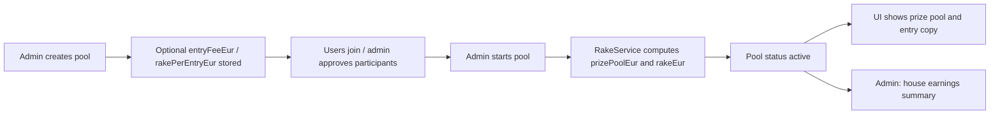

# Rake & financial metadata removal — Survivor Pool

**Status: REMOVED** (completed 2026-05-23 on branch `remove-rake`)

Rake (house fee), per-pool entry fees, and prize pool amounts have been **removed from the application**. The survivor game (picks, elimination, winners) is unchanged. Join flows use generic copy (“pay the admin to confirm your entry”). See [docs/TECHNICAL_REPORT.md](docs/TECHNICAL_REPORT.md) for the current architecture.

**Phases 0–6:** completed. **Phase 7:** documentation updated. **Phase 8:** verification checklist below (update as you QA).

Legacy MongoDB pool documents may still contain `entryFeeEur`, `rakePerEntryEur`, `prizePoolEur`, or `rakeEur`; the app no longer reads or writes them (soft delete).

---

Historical reference — what rake was (before removal)

Reference (obsolete paths): backend `modules/rake/` (deleted), frontend `config/rake/` (deleted).

## What is the rake?

The **rake** is the **house fee** (operator earnings) taken from each participant’s **entry fee** when they join a pool. It is not part of the prize pool that winners compete for.

**Default split (when a pool has no custom fees):**

| Concept | Amount (€) | Meaning |
|--------|------------|---------|
| Entry fee | 50 | What each approved participant pays in |
| Rake per entry | 10 | House keeps this per approved entry |
| Prize per entry | 40 | `entry fee − rake` → goes toward the prize pool |

**Formulas (at pool start, using approved participant count `N`):**

- `prizePoolEur = N × (entryFeeEur − rakePerEntryEur)`
- `rakeEur = N × rakePerEntryEur`

Admins can set **per-pool** `entryFeeEur` and `rakePerEntryEur` at creation (validation: entry fee > 0, rake ≥ 0, rake < entry fee). If omitted on the pool document, backend and frontend fall back to **50€ entry / 10€ rake / 40€ prize per entry**.

**Important:** Rake is **financial metadata** for display and reporting. The survivor game mechanics (picks, elimination, winners) do not use rake; they use `prizePoolEur` once the pool is started. There is no payment integration in code—copy and stored amounts only.

---

## How rake is implemented in the game

### Lifecycle

1. **Create pool** — Admin may send `entryFeeEur` and `rakePerEntryEur` in `POST /api/admin/pool`. Values are stored on the pool if provided.
2. **Open pool** — While status is `open`, `PoolService` **estimates** `prizePoolEur` from current approved count × prize per entry (for listing/join UI). `rakeEur` is not set yet.
3. **Start pool** — `AdminService.startPool` counts **approved** participants, resolves per-entry amounts (pool fields or constants), calls `RakeService.getPrizePoolEur` / `getRakeEur`, then persists `prizePoolEur`, `rakeEur`, and sets status to `active`.
4. **During play** — Leaderboard / pick flows read `pool.prizePoolEur` (e.g. `PickService`). Rake totals do not change unless participants were only counted at start (no recomputation on later approvals after start).
5. **Admin reporting** — `GET /api/admin/rake/summary` sums stored `rakeEur` per pool for dashboard and House earnings page.

### Per-pool vs defaults

Callers resolve amounts like this (see `AdminService.startPool`, `PoolService.getOpenPools`, `getMyStatus`):

- **Entry fee:** `pool.entryFeeEur ?? ENTRY_FEE_EUR` (50)
- **Rake per entry:** `pool.rakePerEntryEur ?? RAKE_PER_ENTRY_EUR` (10)
- **Prize per entry:** `entry fee − rake per entry` → passed to `getPrizePoolEur(count, prizePerEntry)`

If the pool has no custom config, `RakeService` can be called without the second argument and uses `PRIZE_POOL_PER_ENTRY_EUR` (40) and `RAKE_PER_ENTRY_EUR` (10).

---

## Where the rake logic lives

### Backend (`backend/`)

| Location | Role |
|----------|------|
| **`src/modules/rake/rake.constants.ts`** | Defaults: `ENTRY_FEE_EUR` (50), `PRIZE_POOL_PER_ENTRY_EUR` (40), `RAKE_PER_ENTRY_EUR` (10). |
| **`src/modules/rake/rake.service.ts`** | Core math: `getPrizePoolEur`, `getRakeEur`, `getHouseEarningsSummary`. |
| **`src/modules/rake/rake.controller.ts`** | `GET /admin/rake/summary` (admin only). |
| **`src/modules/rake/rake.module.ts`** | Nest module; exports `RakeService`. |
| **`src/modules/rake/index.ts`** | Barrel exports. |
| **`src/modules/admin/admin.service.ts`** | `createPool` stores fee/rake; **`startPool`** computes and saves `prizePoolEur` + `rakeEur`. |
| **`src/modules/admin/admin.interface.ts`** | `CreatePoolDto`: optional `entryFeeEur`, `rakePerEntryEur`; `RakeLessThanEntryFeeConstraint`. |
| **`src/modules/admin/admin.module.ts`** | Imports `RakeModule`. |
| **`src/modules/pool/pool.service.ts`** | `getOpenPools` / `getMyStatus`: prize estimate + `entryFeeEur` / `rakePerEntryEur` for API responses. |
| **`src/modules/pool/schemas/pool.schema.ts`** | MongoDB fields: `entryFeeEur`, `rakePerEntryEur`, `prizePoolEur`, `rakeEur`. |
| **`src/modules/pool/pool.interface.ts`** | TypeScript pool shape (fee/rake fields). |
| **`src/modules/pool/pool.module.ts`** | Imports `RakeModule` (forwardRef). |
| **`src/modules/pool/pool.controller.ts`** | `GET /pools/survivor`, `GET /pools/:poolId/me` expose fee/rake in responses. |
| **`src/modules/survivor/survivor.interface.ts`** | Shared pool type includes fee/rake fields. |
| **`src/modules/pick/pick.service.ts`** | Uses `pool.prizePoolEur` for leaderboard display (not rake math). |
| **`src/app.module.ts`** | Registers `RakeModule`. |
| **`test/admin/admin.service.spec.ts`** | Tests `startPool` sets `prizePoolEur` / `rakeEur` via `RakeService`. |
| **`test/pool/pool.service.spec.ts`** | Mocks `RakeService` for pool listing tests. |

**API surface**

- `POST /api/admin/pool` — optional `entryFeeEur`, `rakePerEntryEur`
- `POST /api/admin/pool/:poolId/start` — locks in `prizePoolEur` and `rakeEur`
- `GET /api/pools/survivor`, `GET /api/pools/:poolId/me` — entry/rake for UI
- `GET /api/admin/rake/summary` — `{ totalRakeEur, byPool: [{ poolId, poolName, rakeEur }] }`

### Frontend (`frontend/`)

| Location | Role |
|----------|------|
| **`src/config/rake/constants.ts`** | UI defaults: `ENTRY_FEE_EUR`, `PRIZE_POOL_EUR`, `RAKE_EUR`, generic `ENTRY_FEE_COPY`. |
| **`src/config/rake/formatEntryFeeCopy.ts`** | `formatEntryFeeCopy(entry, rake)` → `"€X entry (€Y prize pool + €Z fee)"`. |
| **`src/config/rake/index.ts`** | Barrel. |
| **`src/api/pools.api.ts`** | Types + normalizers; default missing `entryFeeEur` / `rakePerEntryEur` to **50 / 10**. |
| **`src/api/admin.api.ts`** | `CreatePoolPayload` fee fields; `getRakeSummary()` → `/admin/rake/summary`. |
| **`src/pages/admin-pages/CreatePool/CreatePool.tsx`** | Form: entry fee & rake per entry; client validation; submit to create API. |
| **`src/pages/admin-pages/Dashboard/Dashboard.tsx`** | House earnings stat from `getRakeSummary()`. |
| **`src/pages/admin-pages/HouseEarnings/HouseEarnings.tsx`** | Full rake summary page (`/admin/house-earnings`). |
| **`src/pages/user-pages/MyPool/MyPool.tsx`** | Per-pool buy-in copy + payment note via `formatEntryFeeCopy`. |
| **`src/pages/Home/Home.tsx`** | Featured pool: same pattern + `HomeFeaturedPool` props. |
| **`src/components/HomeFeaturedPool/HomeFeaturedPool.tsx`** | Displays formatted entry/rake for featured pool. |
| **`src/pages/user-pages/Rules/Rules.tsx`** | Generic `ENTRY_FEE_COPY` only (no pool context). |

**UI vs server:** Prize **amounts** (e.g. “fighting for €X”) come from API `prizePoolEur`. Entry/rake **wording** uses per-pool API fields when present, else `config/rake` defaults so labels never show `undefined`.

---

## Quick mental model

- **Rake** = house’s cut of each entry.
- **Single source of calculation (backend):** `RakeService` + constants; wired at **pool start** and for **open-pool prize previews**.
- **Single source of display defaults (frontend):** `config/rake` + API normalizers.
- **Stored on pool after start:** `prizePoolEur` (winners), `rakeEur` (house earnings report).

---

## Removal plan — to-do tasks

Use this checklist when stripping **rake** (house fee) from the project. Work top-to-bottom; run backend tests and frontend build after each phase.

### Recommended target state (after removal)

| Keep | Remove |
|------|--------|
| `prizePoolEur` on pool (leaderboard, Home, banners) | `rakeEur`, `rakePerEntryEur` |
| Optional `entryFeeEur` (buy-in label) | `RakeModule`, `GET /admin/rake/summary`, House earnings UI |
| Prize at start: `prizePoolEur = approvedCount × entryFeeEur` | Split copy (“€40 prize + €10 fee”) |

**Simplified rule:** full entry fee goes to the prize pool — no house cut in code or UI.

If you also want **no entry fee / prize pool at all**, add the optional tasks in [Phase 6](#phase-6-optional-remove-all-fee--prize-metadata) after the rake removal is done.

---

### Phase 0 — Prep ✅ DONE

- [x] ✅ **0.1** Create a branch (e.g. `remove-rake`).
  - **Done:** Working branch `remove-rake` (tracks `origin/remove-rake`). Created/checked out 2026-05-23.
- [x] ✅ **0.2** Agree on DB handling for existing pools:
  - **Decision: Soft delete** — leave `rakeEur` and `rakePerEntryEur` on existing MongoDB pool documents; application code will stop reading/writing them after Phase 2. No migration script in this effort.
  - **Rationale:** Fastest, non-destructive, reversible; orphaned fields are harmless. Revisit **hard** `$unset` only if compliance or schema hygiene requires a clean database.
- [x] ✅ **0.3** Note API breaking changes for any external clients (see below).

#### Phase 0 — API breaking changes (for integrators)

| Change | Before | After |
|--------|--------|--------|
| Admin rake summary | `GET /api/admin/rake/summary` → `{ totalRakeEur, byPool }` | **Removed** (404) |
| Pool list / my status | Responses may include `rakePerEntryEur` | Field **removed** |
| Pool document (API) | May expose `rakeEur` on started pools | Field **removed** from API (may remain in DB per soft delete) |
| Create pool body | Optional `rakePerEntryEur` | Field **removed**; ignored if sent until endpoint updated |
| Prize pool semantics | `prizePoolEur = N × (entryFee − rakePerEntry)` | `prizePoolEur = N × entryFeeEur` (full entry to prize pool) |

**Non-breaking for typical clients:** `prizePoolEur`, `entryFeeEur`, game/pick/leaderboard endpoints unchanged in path; only rake-specific fields and the admin rake endpoint go away.

---

### Phase 1 — Delete rake-only backend module ✅ DONE

**Delete entire directory:**

- [x] ✅ **1.1** `backend/src/modules/rake/` (all files: `rake.module.ts`, `rake.controller.ts`, `rake.service.ts`, `rake.constants.ts`, `index.ts`, `README.md`)

**Unregister module:**

- [x] ✅ **1.2** `backend/src/app.module.ts` — remove `RakeModule` import and from `imports` array.
- [x] ✅ **1.3** `backend/src/modules/index.ts` — remove `export { RakeModule } from './rake'`.

> **Note:** Backend will not compile until **Phase 2** — `admin.module`, `pool.module`, `admin.service`, and `pool.service` still reference the removed module.

---

### Phase 2 — Backend: decouple pool & admin from rake ✅ DONE

**Schema & types — remove rake fields:**

- [x] ✅ **2.1** `backend/src/modules/pool/schemas/pool.schema.ts` — deleted `rakeEur`, `rakePerEntryEur`; updated comments.
- [x] ✅ **2.2** `backend/src/modules/pool/pool.interface.ts` — removed rake fields.
- [x] ✅ **2.3** `backend/src/modules/survivor/survivor.interface.ts` — removed rake fields; updated `prizePoolEur` comment.

**Admin — create/start pool without rake:**

- [x] ✅ **2.4** `backend/src/modules/admin/admin.interface.ts` — removed `rakePerEntryEur`, `RakeLessThanEntryFeeConstraint`.
- [x] ✅ **2.5** `backend/src/modules/admin/admin.service.ts` — uses `pool/pool.constants.ts` (`ENTRY_FEE_EUR`, `computePrizePoolEur`); no `rakeEur` on start.
- [x] ✅ **2.6** `backend/src/modules/admin/admin.module.ts` — removed `RakeModule`.

**Pool service — open pools / my status:**

- [x] ✅ **2.7** `backend/src/modules/pool/pool.module.ts` — removed `RakeModule` / `forwardRef`.
- [x] ✅ **2.8** `backend/src/modules/pool/pool.service.ts` — inline `computePrizePoolEur`; no `rakePerEntryEur` in responses.
- [x] ✅ **2.9** `backend/src/modules/pool/pool.controller.ts` — JSDoc updated.

**New shared helper:**

- [x] ✅ **`backend/src/modules/pool/pool.constants.ts`** — `ENTRY_FEE_EUR`, `computePrizePoolEur(approvedCount, entryFeeEur)`.

**Unchanged but verify:**

- [x] ✅ **2.10** `backend/src/modules/pick/pick.service.ts` — uses `prizePoolEur` only; no rake references.

> **Note:** Backend **tests** still reference rake (Phase 3). Run `npm run build` in `backend/` — compiles after Phase 2.

---

### Phase 3 — Backend tests ✅ DONE

- [x] ✅ **3.1** `backend/test/admin/admin.service.spec.ts` — removed `rakeService` mock; asserts `prizePoolEur === count × ENTRY_FEE_EUR` (2 × 50 = 100); added custom `entryFeeEur` case.
- [x] ✅ **3.2** `backend/test/pool/pool.service.spec.ts` — removed `RakeService` mock; expects `2 × 50` / `4 × 50` via `ENTRY_FEE_EUR`.
- [x] ✅ **3.3** `backend/test/pick/pick.service.spec.ts` — no rake references; no changes needed.
- [x] ✅ **3.4** `npm test` in `backend/` — all tests passing.

---

### Phase 4 — Delete rake-only frontend ✅ DONE

**Delete directories / pages:**

- [x] ✅ **4.1** `frontend/src/config/rake/` — deleted `constants.ts`, `formatEntryFeeCopy.ts`, `index.ts`.
- [x] ✅ **4.2** `frontend/src/pages/admin-pages/HouseEarnings/` — deleted `HouseEarnings.tsx`, `HouseEarnings.module.less`.

**Routing & nav:**

- [x] ✅ **4.3** `frontend/src/App.tsx` — removed `HouseEarnings` import and `/admin/house-earnings` route.
- [x] ✅ **4.4** `frontend/src/components/AdminSidebar/AdminSidebar.tsx` — removed “House earnings” nav item and `CircleDollarSign` import.

> **Note:** Frontend will not build until **Phase 5** — `Rules`, `MyPool`, `Home` still import `~/config/rake`; `Dashboard` still calls `getRakeSummary()`.

---

### Phase 5 — Frontend: update consumers ✅ DONE

**API layer:**

- [x] ✅ **5.1** `frontend/src/api/admin.api.ts` — removed `rakePerEntryEur`, rake summary types, `getRakeSummary()`.
- [x] ✅ **5.2** `frontend/src/api/pools.api.ts` — removed `rakePerEntryEur` from types and normalizers.

**New `frontend/src/config/pool-fees/`:**

- [x] ✅ `constants.ts` — `ENTRY_FEE_EUR`, `ENTRY_FEE_COPY` (no fee split).
- [x] ✅ `formatEntryCopy.ts` — `formatEntryCopy`, `formatBuyInNote`.
- [x] ✅ `index.ts` — barrel.

**Updated consumers:**

- [x] ✅ **5.3** `CreatePool.tsx` — entry fee only; helper text for full entry → prize pool.
- [x] ✅ **5.4** `Dashboard.tsx` — removed house earnings stat and `getRakeSummary` effect.
- [x] ✅ **5.5** `Dashboard.module.less` — removed unused `.rake*` styles.
- [x] ✅ **5.6** `MyPool.tsx` — `formatBuyInNote` from `pool-fees`.
- [x] ✅ **5.7** `Home.tsx` — simplified `HomeFeaturedPool` props.
- [x] ✅ **5.8** `HomeFeaturedPool.tsx` — entry fee only via `formatBuyInNote`.
- [x] ✅ **5.9** `Rules.tsx` — `ENTRY_FEE_COPY` from `pool-fees`.

**Verified (prize pool only, no rake):**

- [x] ✅ **5.10** `PrizePoolBanner.tsx` — unchanged; uses `prizePoolEur` only.
- [x] ✅ **5.11** `Leaderboard/**` — unchanged; uses `prizePoolEur` only.
- [x] ✅ **5.12** `Home/hooks/*`, `home.helpers.ts` — unchanged; no rake refs.

- [x] ✅ **5.13** `npm run build` in `frontend/` — success.

---

### Phase 6 — Optional: remove all fee / prize metadata ✅ DONE

- [x] ✅ **6.1** Removed `entryFeeEur` and `prizePoolEur` from pool schema, interfaces, admin/pool APIs, CreatePool form, MyPool/Home join copy, deleted `PrizePoolBanner` and `config/pool-fees/`, Leaderboard winners banner (no prize amounts).
- [x] ✅ **6.2** `PickService.getLeaderboard` — no longer returns `prizePoolEur`; removed pool fetch used only for prize.
- [x] ✅ **6.3** Frontend `pools.api.ts` leaderboard types updated; Home stats banner shows players/round only (no prize column).

---

---

### Summary: files to delete vs edit

| Action | Paths |
|--------|--------|
| **Delete** | `backend/src/modules/rake/**` |
| **Delete** | `frontend/src/config/rake/**` |
| **Delete** | `frontend/src/pages/admin-pages/HouseEarnings/**` |
| **Edit** | `backend/src/app.module.ts`, `modules/index.ts`, `admin/*`, `pool/*`, `survivor/survivor.interface.ts`, `backend/test/**` |
| **Edit** | `frontend/src/App.tsx`, `AdminSidebar`, `api/admin.api.ts`, `api/pools.api.ts`, `CreatePool`, `Dashboard` (+ `.module.less`), `MyPool`, `Home`, `HomeFeaturedPool`, `Rules` |
| **Edit (docs)** | `docs/TECHNICAL_REPORT.md`, `frontend/skeleton_frontend`, optionally this file |

### How removal works (approach)

1. **Cut the rake module first** so nothing imports `RakeService` (compiler will list remaining references).
2. **Inline prize math** in `AdminService.startPool` and `PoolService` as `count × entryFee` — same behavior as today when rake was 0, or as today’s “prize per entry” without subtracting rake.
3. **Strip UI and API surface** for house earnings and fee-split copy; keep prize pool UX unless Phase 6 is in scope.
4. **Tests + grep** to prevent regressions.

Do **not** leave a hollow `RakeService` with only `getPrizePoolEur` — rename/move a tiny `pool-fee` helper under `pool/` if you want shared math, or keep the one-liner inline to avoid a misleading module name.

---

### Phase 7 — Documentation & housekeeping ✅ DONE

- [x] ✅ **7.1** `docs/TECHNICAL_REPORT.md` — removed rake module, house earnings API, fee/prize schema fields; updated admin rules, APIs, game flow, and features; added removal note.
- [x] ✅ **7.2** `rake_logic.md` — this file: completion banner at top; historical content kept in collapsed section.
- [x] ✅ **7.3** `frontend/skeleton_frontend` — removed `config/rake/`, `PrizePoolBanner/`; updated notes.
- [x] ✅ **7.4** Grep in `backend/src` and `frontend/src`: **zero** matches for `RakeService`, `RakeModule`, `rakePerEntry`, `getRakeSummary`, `house-earnings`, `formatEntryFeeCopy`, `pool-fees`, `PrizePoolBanner` (only unrelated `rake` substring in `tournament-logo.svg` binary).

---

### Phase 8 — Verification checklist ✅ DONE

Verified 2026-05-23 (code inspection + automated tests).

- [x] ✅ **8.1** `CreatePoolDto` has `name`, `description`, `tournamentKey` only; `CreatePool.tsx` has no fee inputs; `admin.service.spec` / `admin.controller.spec` create pool with name/description only.
- [x] ✅ **8.2** `AdminService.startPool` sets `status = 'active'` and `startedAt` only; test asserts `prizePoolEur` / `entryFeeEur` stay undefined on save.
- [x] ✅ **8.3** `PoolService.getOpenPools` / `getMyStatus` return id, name, status, participant counts, tournamentKey, membership fields only (no fee/prize keys); `pool.service.spec` matches.
- [x] ✅ **8.4** `backend/src/modules/rake/` deleted; no `rake` routes on `AdminController` (unknown path → 404 at runtime).
- [x] ✅ **8.5** `App.tsx` has no `/admin/house-earnings`; `Dashboard.tsx` has no house earnings stat or `getRakeSummary`.
- [x] ✅ **8.6** MyPool / `HomeFeaturedPool`: “pay the pool admin to confirm your entry”; Rules: same generic copy; no `€` fee-split strings in pages.
- [x] ✅ **8.7** `PrizePoolBanner` removed; `LeaderboardHeader` winners banner lists names only (no prize amounts).
- [x] ✅ **8.8** Backend: **144 tests passed** (`npm test`). Frontend: **`npm run build` succeeded**.
