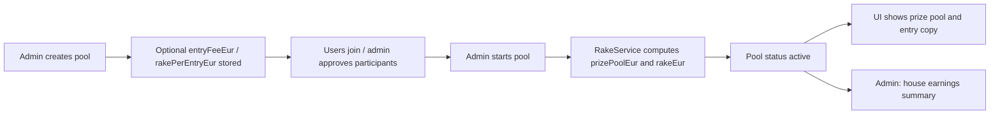

# Rake logic — Survivor Pool

Reference: [docs/TECHNICAL_REPORT.md](docs/TECHNICAL_REPORT.md) (admin rules, rake module, API, game flow). Backend detail: [backend/src/modules/rake/README.md](backend/src/modules/rake/README.md).

---

## What is the rake?

The **rake** is the **house fee** (operator earnings) taken from each participant’s **entry fee** when they join a pool. It is not part of the prize pool that winners compete for.

**Default split (when a pool has no custom fees):**

| Concept | Amount (€) | Meaning |
|--------|------------|---------|
| Entry fee | 50 | What each approved participant pays in |
| Rake per entry | 10 | House keeps this per approved entry |
| Prize per entry | 40 | `entry fee − rake` → goes toward the prize pool |

**Formulas (at pool start, using approved participant count `N`):**

- `prizePoolEur = N × (entryFeeEur − rakePerEntryEur)`
- `rakeEur = N × rakePerEntryEur`

Admins can set **per-pool** `entryFeeEur` and `rakePerEntryEur` at creation (validation: entry fee > 0, rake ≥ 0, rake < entry fee). If omitted on the pool document, backend and frontend fall back to **50€ entry / 10€ rake / 40€ prize per entry**.

**Important:** Rake is **financial metadata** for display and reporting. The survivor game mechanics (picks, elimination, winners) do not use rake; they use `prizePoolEur` once the pool is started. There is no payment integration in code—copy and stored amounts only.

---

## How rake is implemented in the game

### Lifecycle

1. **Create pool** — Admin may send `entryFeeEur` and `rakePerEntryEur` in `POST /api/admin/pool`. Values are stored on the pool if provided.
2. **Open pool** — While status is `open`, `PoolService` **estimates** `prizePoolEur` from current approved count × prize per entry (for listing/join UI). `rakeEur` is not set yet.
3. **Start pool** — `AdminService.startPool` counts **approved** participants, resolves per-entry amounts (pool fields or constants), calls `RakeService.getPrizePoolEur` / `getRakeEur`, then persists `prizePoolEur`, `rakeEur`, and sets status to `active`.
4. **During play** — Leaderboard / pick flows read `pool.prizePoolEur` (e.g. `PickService`). Rake totals do not change unless participants were only counted at start (no recomputation on later approvals after start).
5. **Admin reporting** — `GET /api/admin/rake/summary` sums stored `rakeEur` per pool for dashboard and House earnings page.

### Per-pool vs defaults

Callers resolve amounts like this (see `AdminService.startPool`, `PoolService.getOpenPools`, `getMyStatus`):

- **Entry fee:** `pool.entryFeeEur ?? ENTRY_FEE_EUR` (50)
- **Rake per entry:** `pool.rakePerEntryEur ?? RAKE_PER_ENTRY_EUR` (10)
- **Prize per entry:** `entry fee − rake per entry` → passed to `getPrizePoolEur(count, prizePerEntry)`

If the pool has no custom config, `RakeService` can be called without the second argument and uses `PRIZE_POOL_PER_ENTRY_EUR` (40) and `RAKE_PER_ENTRY_EUR` (10).

---

## Where the rake logic lives

### Backend (`backend/`)

| Location | Role |
|----------|------|
| **`src/modules/rake/rake.constants.ts`** | Defaults: `ENTRY_FEE_EUR` (50), `PRIZE_POOL_PER_ENTRY_EUR` (40), `RAKE_PER_ENTRY_EUR` (10). |
| **`src/modules/rake/rake.service.ts`** | Core math: `getPrizePoolEur`, `getRakeEur`, `getHouseEarningsSummary`. |
| **`src/modules/rake/rake.controller.ts`** | `GET /admin/rake/summary` (admin only). |
| **`src/modules/rake/rake.module.ts`** | Nest module; exports `RakeService`. |
| **`src/modules/rake/index.ts`** | Barrel exports. |
| **`src/modules/admin/admin.service.ts`** | `createPool` stores fee/rake; **`startPool`** computes and saves `prizePoolEur` + `rakeEur`. |
| **`src/modules/admin/admin.interface.ts`** | `CreatePoolDto`: optional `entryFeeEur`, `rakePerEntryEur`; `RakeLessThanEntryFeeConstraint`. |
| **`src/modules/admin/admin.module.ts`** | Imports `RakeModule`. |
| **`src/modules/pool/pool.service.ts`** | `getOpenPools` / `getMyStatus`: prize estimate + `entryFeeEur` / `rakePerEntryEur` for API responses. |
| **`src/modules/pool/schemas/pool.schema.ts`** | MongoDB fields: `entryFeeEur`, `rakePerEntryEur`, `prizePoolEur`, `rakeEur`. |
| **`src/modules/pool/pool.interface.ts`** | TypeScript pool shape (fee/rake fields). |
| **`src/modules/pool/pool.module.ts`** | Imports `RakeModule` (forwardRef). |
| **`src/modules/pool/pool.controller.ts`** | `GET /pools/survivor`, `GET /pools/:poolId/me` expose fee/rake in responses. |
| **`src/modules/survivor/survivor.interface.ts`** | Shared pool type includes fee/rake fields. |
| **`src/modules/pick/pick.service.ts`** | Uses `pool.prizePoolEur` for leaderboard display (not rake math). |
| **`src/app.module.ts`** | Registers `RakeModule`. |
| **`test/admin/admin.service.spec.ts`** | Tests `startPool` sets `prizePoolEur` / `rakeEur` via `RakeService`. |
| **`test/pool/pool.service.spec.ts`** | Mocks `RakeService` for pool listing tests. |

**API surface**

- `POST /api/admin/pool` — optional `entryFeeEur`, `rakePerEntryEur`
- `POST /api/admin/pool/:poolId/start` — locks in `prizePoolEur` and `rakeEur`
- `GET /api/pools/survivor`, `GET /api/pools/:poolId/me` — entry/rake for UI
- `GET /api/admin/rake/summary` — `{ totalRakeEur, byPool: [{ poolId, poolName, rakeEur }] }`

### Frontend (`frontend/`)

| Location | Role |
|----------|------|
| **`src/config/rake/constants.ts`** | UI defaults: `ENTRY_FEE_EUR`, `PRIZE_POOL_EUR`, `RAKE_EUR`, generic `ENTRY_FEE_COPY`. |
| **`src/config/rake/formatEntryFeeCopy.ts`** | `formatEntryFeeCopy(entry, rake)` → `"€X entry (€Y prize pool + €Z fee)"`. |
| **`src/config/rake/index.ts`** | Barrel. |
| **`src/api/pools.api.ts`** | Types + normalizers; default missing `entryFeeEur` / `rakePerEntryEur` to **50 / 10**. |
| **`src/api/admin.api.ts`** | `CreatePoolPayload` fee fields; `getRakeSummary()` → `/admin/rake/summary`. |
| **`src/pages/admin-pages/CreatePool/CreatePool.tsx`** | Form: entry fee & rake per entry; client validation; submit to create API. |
| **`src/pages/admin-pages/Dashboard/Dashboard.tsx`** | House earnings stat from `getRakeSummary()`. |
| **`src/pages/admin-pages/HouseEarnings/HouseEarnings.tsx`** | Full rake summary page (`/admin/house-earnings`). |
| **`src/pages/user-pages/MyPool/MyPool.tsx`** | Per-pool buy-in copy + payment note via `formatEntryFeeCopy`. |
| **`src/pages/Home/Home.tsx`** | Featured pool: same pattern + `HomeFeaturedPool` props. |
| **`src/components/HomeFeaturedPool/HomeFeaturedPool.tsx`** | Displays formatted entry/rake for featured pool. |
| **`src/pages/user-pages/Rules/Rules.tsx`** | Generic `ENTRY_FEE_COPY` only (no pool context). |

**UI vs server:** Prize **amounts** (e.g. “fighting for €X”) come from API `prizePoolEur`. Entry/rake **wording** uses per-pool API fields when present, else `config/rake` defaults so labels never show `undefined`.

---

## Quick mental model

- **Rake** = house’s cut of each entry.
- **Single source of calculation (backend):** `RakeService` + constants; wired at **pool start** and for **open-pool prize previews**.
- **Single source of display defaults (frontend):** `config/rake` + API normalizers.
- **Stored on pool after start:** `prizePoolEur` (winners), `rakeEur` (house earnings report).

---

## Removal plan — to-do tasks

Use this checklist when stripping **rake** (house fee) from the project. Work top-to-bottom; run backend tests and frontend build after each phase.

### Recommended target state (after removal)

| Keep | Remove |
|------|--------|
| `prizePoolEur` on pool (leaderboard, Home, banners) | `rakeEur`, `rakePerEntryEur` |
| Optional `entryFeeEur` (buy-in label) | `RakeModule`, `GET /admin/rake/summary`, House earnings UI |
| Prize at start: `prizePoolEur = approvedCount × entryFeeEur` | Split copy (“€40 prize + €10 fee”) |

**Simplified rule:** full entry fee goes to the prize pool — no house cut in code or UI.

If you also want **no entry fee / prize pool at all**, add the optional tasks in [Phase 6](#phase-6-optional-remove-all-fee--prize-metadata) after the rake removal is done.

---

### Phase 0 — Prep

- [ ] **0.1** Create a branch (e.g. `remove-rake`).
- [ ] **0.2** Agree on DB handling for existing pools:
  - **Soft:** leave `rakeEur` / `rakePerEntryEur` in MongoDB but stop reading/writing them (fastest).
  - **Hard:** one-off script or migration to `$unset` those fields on all pool documents.
- [ ] **0.3** Note API breaking changes for any external clients: remove `rakePerEntryEur` from pool responses; remove `GET /api/admin/rake/summary`.

---

### Phase 1 — Delete rake-only backend module

**Delete entire directory:**

- [ ] **1.1** `backend/src/modules/rake/` (all files: `rake.module.ts`, `rake.controller.ts`, `rake.service.ts`, `rake.constants.ts`, `index.ts`, `README.md`)

**Unregister module:**

- [ ] **1.2** `backend/src/app.module.ts` — remove `RakeModule` import and from `imports` array.
- [ ] **1.3** `backend/src/modules/index.ts` — remove `export { RakeModule } from './rake'`.

---

### Phase 2 — Backend: decouple pool & admin from rake

**Schema & types — remove rake fields:**

- [ ] **2.1** `backend/src/modules/pool/schemas/pool.schema.ts` — delete `rakeEur`, `rakePerEntryEur` schema paths; update comments on `prizePoolEur` / `entryFeeEur`.
- [ ] **2.2** `backend/src/modules/pool/pool.interface.ts` — remove `rakeEur?`, `rakePerEntryEur?`.
- [ ] **2.3** `backend/src/modules/survivor/survivor.interface.ts` — remove `rakeEur?`, `rakePerEntryEur?`; fix comments on `prizePoolEur`.

**Admin — create/start pool without rake:**

- [ ] **2.4** `backend/src/modules/admin/admin.interface.ts` — remove `rakePerEntryEur` from `CreatePoolDto`; delete `RakeLessThanEntryFeeConstraint` class and `@Validate` usage; keep `entryFeeEur` optional if you still want configurable buy-in.
- [ ] **2.5** `backend/src/modules/admin/admin.service.ts`:
  - Remove `RakeService` injection and imports from `../rake/*`.
  - `createPool`: stop destructuring/passing `rakePerEntryEur`.
  - `startPool`: set `pool.prizePoolEur = participantsCount * (pool.entryFeeEur ?? DEFAULT_ENTRY_FEE_EUR)` inline (move `ENTRY_FEE_EUR` to e.g. `pool/pool.constants.ts` or keep a single constant in `admin.service` / `pool.service` — do **not** reintroduce a rake module).
  - Remove assignment to `pool.rakeEur`.
- [ ] **2.6** `backend/src/modules/admin/admin.module.ts` — remove `RakeModule` from `imports`.

**Pool service — open pools / my status:**

- [ ] **2.7** `backend/src/modules/pool/pool.module.ts` — remove `RakeModule` import and `forwardRef(() => RakeModule)`.
- [ ] **2.8** `backend/src/modules/pool/pool.service.ts`:
  - Remove `RakeService` injection and `../rake/*` imports.
  - `getOpenPools` / `getMyStatus`: compute `prizePoolEur` as `approvedCount * (pool.entryFeeEur ?? ENTRY_FEE_EUR)` for `open` pools; for active/finished use stored `pool.prizePoolEur`.
  - Stop returning `rakePerEntryEur` in API payloads.
- [ ] **2.9** `backend/src/modules/pool/pool.controller.ts` — update JSDoc comments (no `rakePerEntryEur`).

**Unchanged but verify:**

- [ ] **2.10** `backend/src/modules/pick/pick.service.ts` — still uses `prizePoolEur` only; no change unless you remove prize pool entirely.

---

### Phase 3 — Backend tests

- [ ] **3.1** `backend/test/admin/admin.service.spec.ts` — remove `rakeService` mock and `getRakeEur` expectations; assert `prizePoolEur === count * entryFee` (e.g. 2 × 50 = 100 if default entry is 50).
- [ ] **3.2** `backend/test/pool/pool.service.spec.ts` — remove `RakeService` mock; test inline prize calculation.
- [ ] **3.3** `backend/test/pick/pick.service.spec.ts` — grep for rake; adjust fixtures if they set `rakePerEntryEur`.
- [ ] **3.4** Run `npm test` (or project test command) in `backend/` until green.

---

### Phase 4 — Delete rake-only frontend

**Delete directories / pages:**

- [ ] **4.1** `frontend/src/config/rake/` — entire folder (`constants.ts`, `formatEntryFeeCopy.ts`, `index.ts`).
- [ ] **4.2** `frontend/src/pages/admin-pages/HouseEarnings/` — `HouseEarnings.tsx`, `HouseEarnings.module.less`.

**Routing & nav:**

- [ ] **4.3** `frontend/src/App.tsx` — remove `HouseEarnings` import and route `/admin/house-earnings`.
- [ ] **4.4** `frontend/src/components/AdminSidebar/AdminSidebar.tsx` — remove “House earnings” nav item.

---

### Phase 5 — Frontend: update consumers

**API layer:**

- [ ] **5.1** `frontend/src/api/admin.api.ts` — remove `rakePerEntryEur` from `CreatePoolPayload`; delete `RakeSummaryResponse`, `RakeSummaryPoolEntry`, `getRakeSummary()`.
- [ ] **5.2** `frontend/src/api/pools.api.ts` — remove `rakePerEntryEur` from types and normalizers; remove `DEFAULT_RAKE_PER_ENTRY_EUR`.

**Replace `config/rake` usage** — add `frontend/src/config/pool-fees/` (or similar) with only what you need, e.g.:

- `ENTRY_FEE_EUR = 50`
- `formatEntryCopy(entryFeeEur)` → `"€50 entry"` or `"€50 buy-in"`

Then update imports:

- [ ] **5.3** `frontend/src/pages/admin-pages/CreatePool/CreatePool.tsx` — remove rake field, validation, and payload key; keep entry fee only (optional).
- [ ] **5.4** `frontend/src/pages/admin-pages/Dashboard/Dashboard.tsx` — remove `rakeSummary` state, `getRakeSummary()` effect, and “House earnings” stat card; remove `formatRakeEur` if unused.
- [ ] **5.5** `frontend/src/pages/admin-pages/Dashboard/Dashboard.module.less` — delete unused `.rakeSection`, `.rakeList`, etc. (dead styles today if only stat card used them).
- [ ] **5.6** `frontend/src/pages/user-pages/MyPool/MyPool.tsx` — replace `formatEntryFeeCopy(..., rake)` with simple entry copy; remove `RAKE_EUR` import.
- [ ] **5.7** `frontend/src/pages/Home/Home.tsx` — stop passing `formatEntryFeeCopy`, `defaultRakeEur`; simplify props.
- [ ] **5.8** `frontend/src/components/HomeFeaturedPool/HomeFeaturedPool.tsx` — remove `rakePerEntryEur`, `defaultRakeEur`, `formatEntryFeeCopy` rake parameter; show entry fee / prize pool only.
- [ ] **5.9** `frontend/src/pages/user-pages/Rules/Rules.tsx` — replace `ENTRY_FEE_COPY` with generic copy without fee split (e.g. “Entry fee applies per pool” or fixed `€50 entry`).

**No rake references (prize pool only — verify after edits):**

- [ ] **5.10** `frontend/src/components/PrizePoolBanner/PrizePoolBanner.tsx`
- [ ] **5.11** `frontend/src/pages/user-pages/Leaderboard/**` (uses `prizePoolEur` only)
- [ ] **5.12** `frontend/src/pages/Home/hooks/*`, `home.helpers.ts`

- [ ] **5.13** Run `npm run build` (and lint) in `frontend/`.

---

### Phase 6 — Optional: remove all fee / prize metadata

Only if the product should have **no** buy-in or prize amounts in the app:

- [ ] **6.1** Remove `entryFeeEur` and `prizePoolEur` from pool schema, APIs, CreatePool form, MyPool/Home buy-in UI, `PrizePoolBanner`, Leaderboard prize display.
- [ ] **6.2** `PickService` — stop returning `prizePoolEur` in leaderboard payload.
- [ ] **6.3** Large doc/UI sweep — this is a separate feature removal, not required for rake-only removal.

---

### Phase 7 — Documentation & housekeeping

- [ ] **7.1** `docs/TECHNICAL_REPORT.md` — remove rake module section, house earnings API, rake fields in schema, game-flow rake steps (~32 mentions).
- [ ] **7.2** `rake_logic.md` — archive or replace this file with a short note (“rake removed on &lt;date&gt;”) or delete if no longer needed.
- [ ] **7.3** `frontend/skeleton_frontend` — update tree comment for `config/rake/` and rake-related bullets.
- [ ] **7.4** Repo-wide grep: `rake`, `RakeService`, `RakeModule`, `rakePerEntry`, `getRakeSummary`, `house-earnings`, `formatEntryFeeCopy`, `RAKE_` — expect **zero** hits in `src/` (except changelog/history if you keep any).

---

### Phase 8 — Verification checklist

- [ ] **8.1** Admin can create pool with entry fee only (no rake field).
- [ ] **8.2** Starting pool sets `prizePoolEur = N × entryFeeEur` and does **not** set `rakeEur`.
- [ ] **8.3** `GET /api/pools/survivor` and `GET /api/pools/:id/me` return `entryFeeEur` + `prizePoolEur`, no rake fields.
- [ ] **8.4** `GET /api/admin/rake/summary` returns **404** (route removed).
- [ ] **8.5** No `/admin/house-earnings` route; Dashboard has no house earnings card.
- [ ] **8.6** MyPool / Home / Rules show copy without “+ €X fee”.
- [ ] **8.7** Leaderboard and prize banners still show correct `prizePoolEur` for active pools.
- [ ] **8.8** Backend + frontend tests pass.

---

### Summary: files to delete vs edit

| Action | Paths |
|--------|--------|
| **Delete** | `backend/src/modules/rake/**` |
| **Delete** | `frontend/src/config/rake/**` |
| **Delete** | `frontend/src/pages/admin-pages/HouseEarnings/**` |
| **Edit** | `backend/src/app.module.ts`, `modules/index.ts`, `admin/*`, `pool/*`, `survivor/survivor.interface.ts`, `backend/test/**` |
| **Edit** | `frontend/src/App.tsx`, `AdminSidebar`, `api/admin.api.ts`, `api/pools.api.ts`, `CreatePool`, `Dashboard` (+ `.module.less`), `MyPool`, `Home`, `HomeFeaturedPool`, `Rules` |
| **Edit (docs)** | `docs/TECHNICAL_REPORT.md`, `frontend/skeleton_frontend`, optionally this file |

### How removal works (approach)

1. **Cut the rake module first** so nothing imports `RakeService` (compiler will list remaining references).
2. **Inline prize math** in `AdminService.startPool` and `PoolService` as `count × entryFee` — same behavior as today when rake was 0, or as today’s “prize per entry” without subtracting rake.
3. **Strip UI and API surface** for house earnings and fee-split copy; keep prize pool UX unless Phase 6 is in scope.
4. **Tests + grep** to prevent regressions.

Do **not** leave a hollow `RakeService` with only `getPrizePoolEur` — rename/move a tiny `pool-fee` helper under `pool/` if you want shared math, or keep the one-liner inline to avoid a misleading module name.
